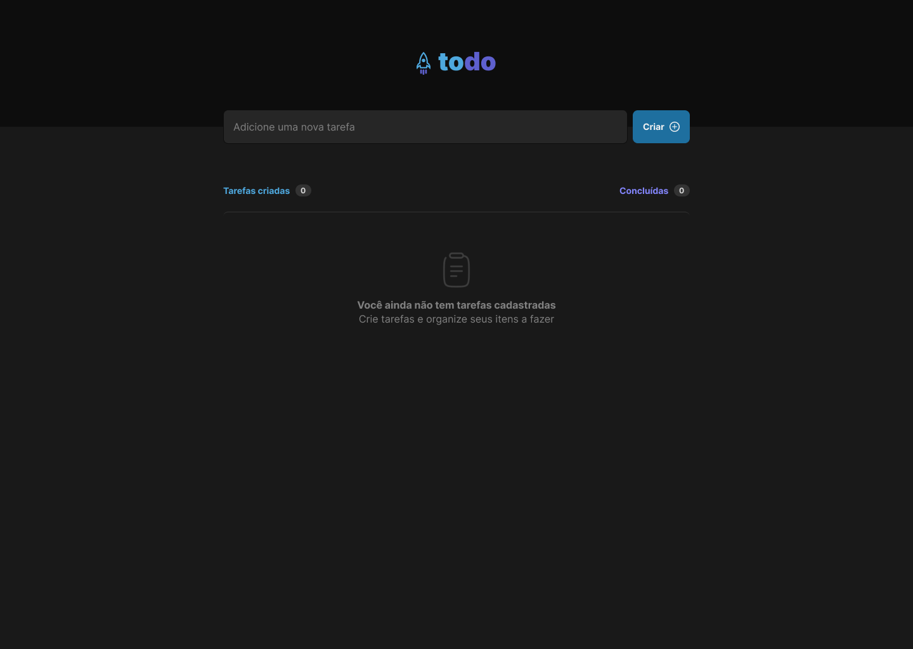
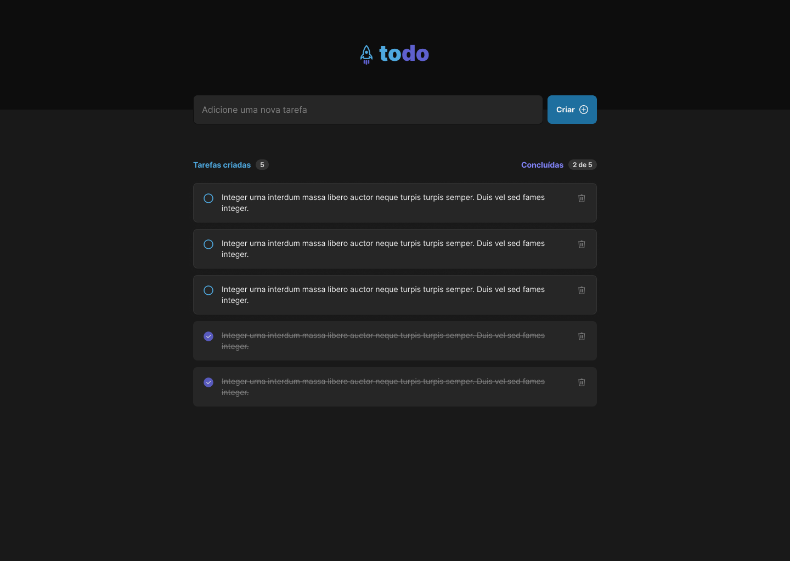

<p align="center">
  <a href="todo-rocket.netlify.app">
    
  </a>
</p>
<h1 align="center">
  Todo List

</h1>
<p align="center">
  

<p align="center">
  <strong>
    Organize - se. Encontra - se. Produza.
  </strong>
</p>
<p align="center">
Todo é uma ferramenta que lhe auxiliará nas suas tarefas diárias. Contribuindo para o desempenho, produtividade e organização no seu dia a dia.
</p>
  
  <p align="center">
  

  

  <a href="https://twitter.com/PauloRougdries/">
    
  </a>
  
  <a href="https://github.com/paulosoares7/todo/commits/main">
    
  </a>
    
   
   <a href="https://github.com/paulosaores7/todo/stargazers">
    
  </a> 
</p>

<h4 align="center"> 
	🚧  Todo List ✔ Em construção 🕐 🚧
</h4>

<h2 align="center">
 <a href="#-sobre-o-projeto">Sobre</a> •
 <a href="#-funcionalidades">Funcionalidades</a> •
 <a href="#-layout">Layout</a> • 
 <a href="#-como-executar">Como executar</a> • 
 <a href="#-tecnologias">Tecnologias</a> • 
 <a href="#-autor">Autor</a> • 
 <a href="#user-content--licença">Licença</a>
</h2>

## 💻 Sobre o projeto

✅ Todo List - É um desafio proposto pela [Rocketseat](https://rocketseat.com.br/), ao longo da trilha **Ignite** 🚀, na qual a primícia era criar uma lista de tarefas usando usando fundamentos do React.js. Outros conceitos que podemos destacar, é o usos dos métodos map e filter pra dar funcionalidade na aplicação desenvolvida.
 
 O Ignite é uma experiência online com muito conteúdo prático, desafios e hacks onde o conteúdo fica disponível em módulos na plataforma da instiuição para seus alunos.

## ✨ Funcionalidades

  - **📋 Adicionar tarefas**
  - **✔ Marcar como completa**
  - **🗑️ Excluir tarefas**
  - **🔵 Contablizar total de tarefas**
  - **🟣 Enumerar tarefas concluídas do total**

## 🎨 Layout

O layout da aplicação para web:

### 🖥 Web

<p align="center" style="display: flex; align-items: flex-start; justify-content: center;">
  
  
</p>

### 📽 Preview

<p align="center">
  
</p>

## 🚀 Como executar

### Pré-requisitos

Antes de começar, você vai precisar ter instalado em sua máquina as seguintes ferramentas:
[Git](https://git-scm.com), [Node.js](https://nodejs.org/en/). 
Além disto é bom ter um editor para trabalhar com o código como [VSCode](https://code.visualstudio.com/)
```bash
# Clone este repositório
$ git clone git@github.com:paulosoares7/todo.git

# Acesse a pasta do projeto no seu terminal/cmd
$ cd todo

# Instale as dependências
$ npm install

# Execute a aplicação em modo de desenvolvimento
$ npm run start

# A aplicação será aberta na porta:3000 - acesse http://localhost:3000
```

## 🛠 Tecnologias

As seguintes ferramentas foram usadas na construção do projeto:

#### **Website**  ([React](https://reactjs.org/)  +  [TypeScript](https://www.typescriptlang.org/))

-   **[Sass](https://sass-lang.com)**
-   **[Phosphor Icons](https://phosphoricons.com)**
-   **[Vit](https://vitejs.dev)**


> Veja o arquivo  [package.json](https://github.com/paulosoares7/todo/blob/master/package.json)


## 🦸 Autor

 
 <br />
 <sub><b>Paulo Soares</b></sub>
 <br />

[](https://twitter.com/PauloRougdries) [](https://www.linkedin.com/in/paulosoares7/) 
[](mailto:paulosoaresrodrigues@outlook.com)


---

## 📝 Licença

Este projeto esta sobe a licença [MIT](./LICENSE).

Feito com ❤️ por Paulo Soares 👋🏽 [Entre em contato!](https://www.linkedin.com/in/paulosoares7)

---

## Mostre seu apoio

Dê um ⭐ se este projeto o ajudou!
